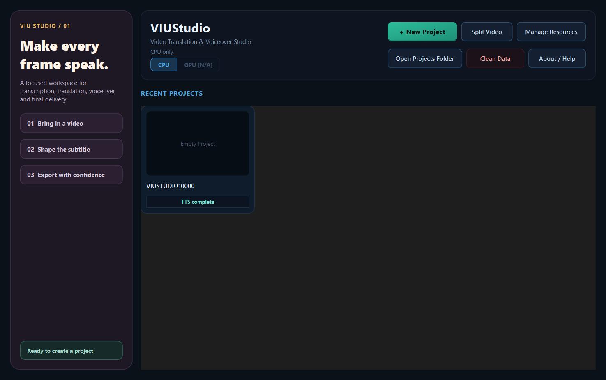
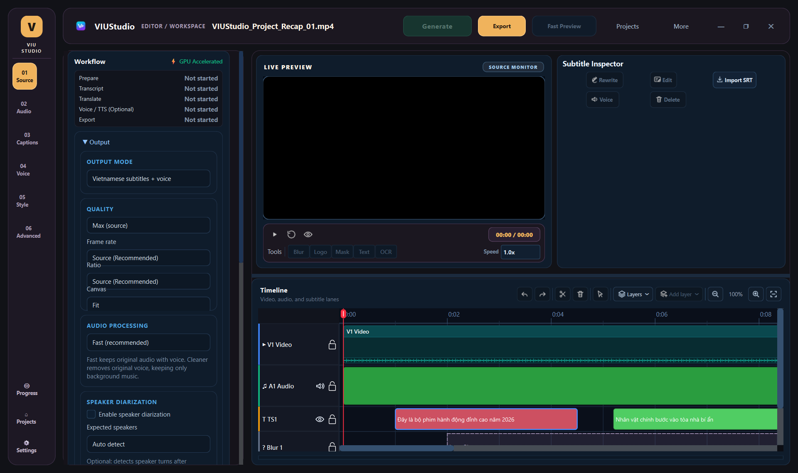
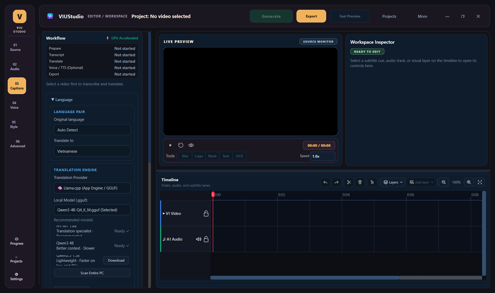
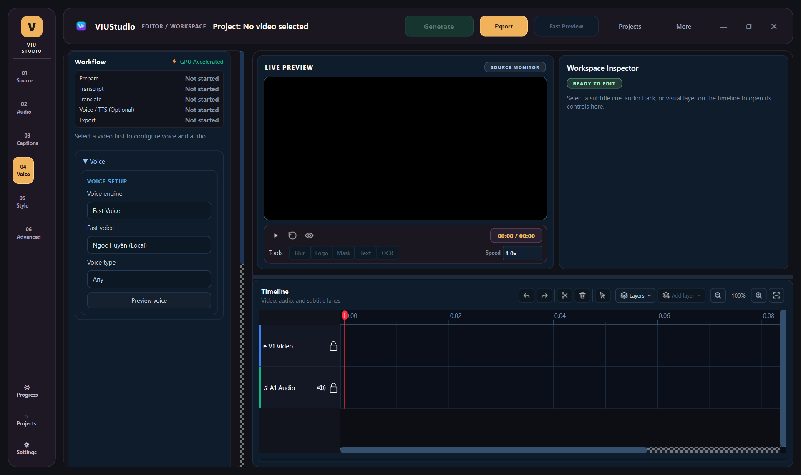
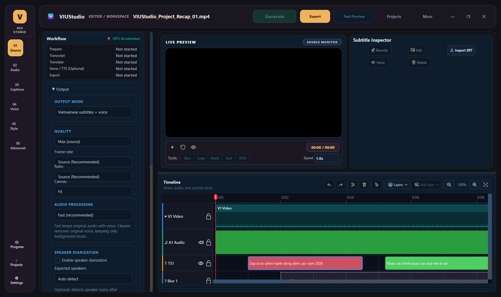
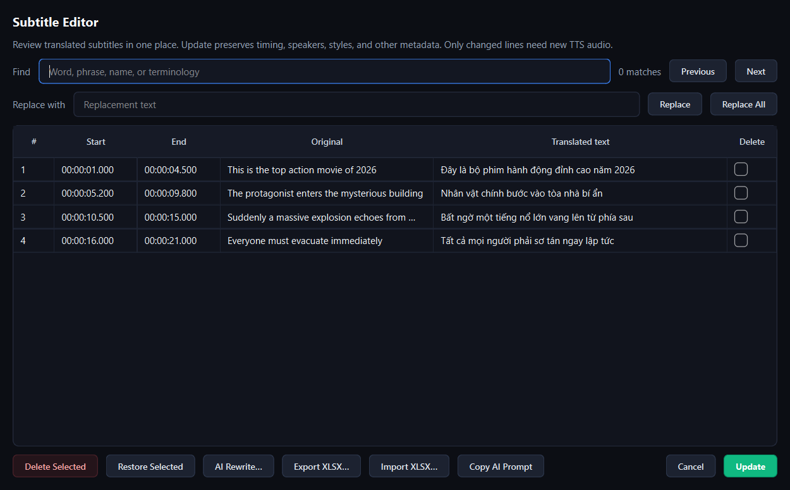
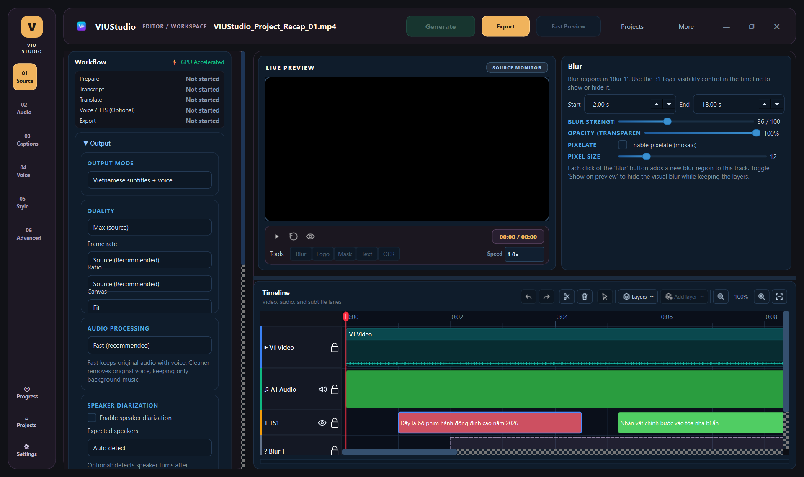
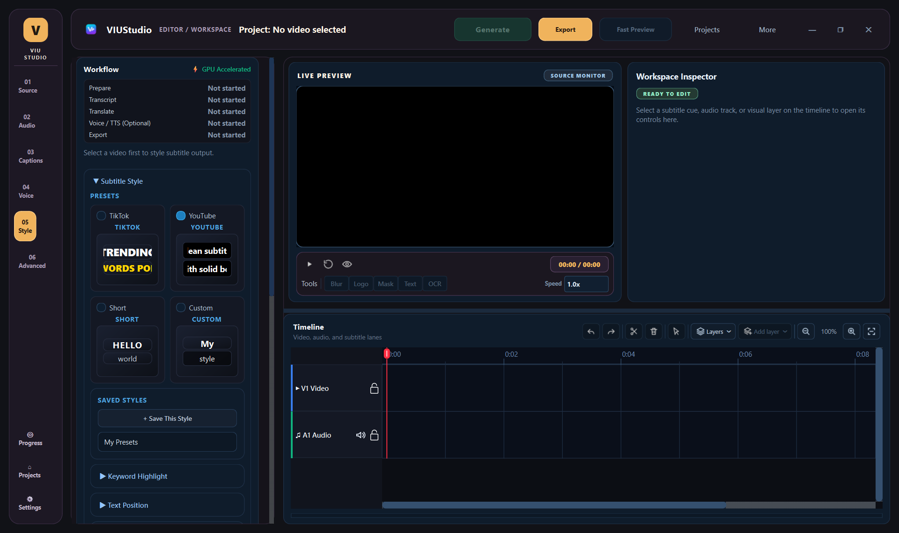
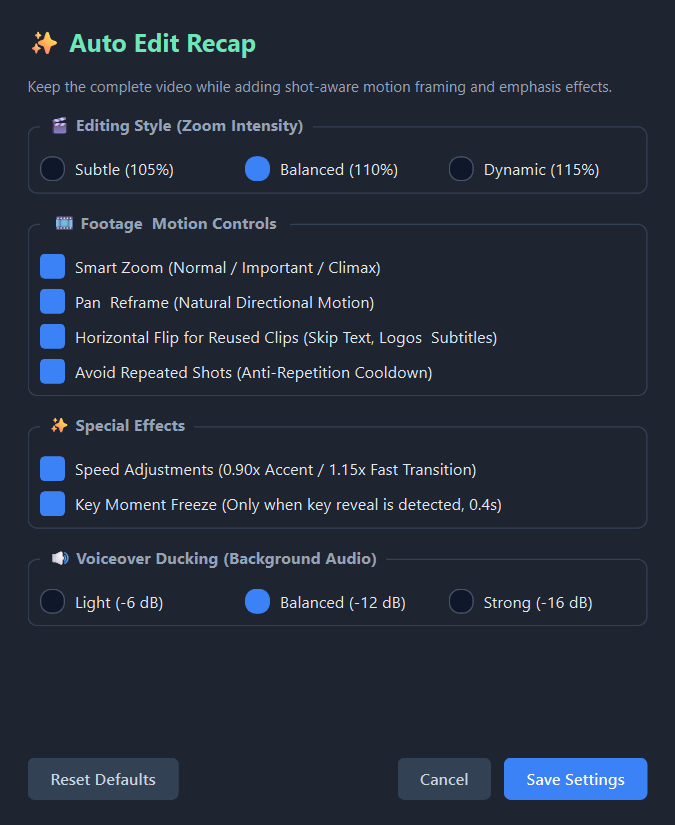
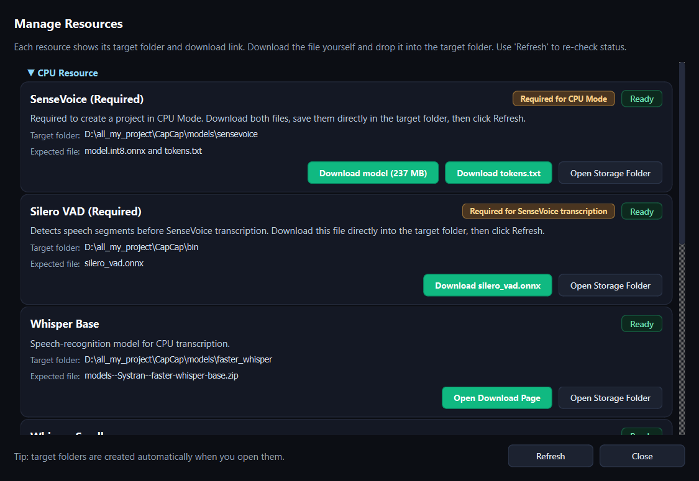

# Hướng dẫn sử dụng VIUStudio (Comprehensive User Guide)

VIUStudio là ứng dụng Windows Desktop chuyên biệt dành cho biên tập viên, nhà sáng tạo nội dung video recap/review phim, và dịch giả phụ đề. Ứng dụng tích hợp các mô hình trí tuệ nhân tạo (AI) mạnh mẽ nhất hiện nay để tự động hóa toàn bộ quy trình: từ trích xuất lời thoại, dịch thuật đa ngữ, tạo giọng đọc thuyết minh (TTS), đến cắt ghép, chỉnh sửa trên dòng thời gian (Timeline) và xuất bản video chất lượng cao.

---

## 1. Khởi động ứng dụng & Quản lý dự án (Launcher)

Khi khởi động VIUStudio, màn hình **Launcher** sẽ xuất hiện cho phép bạn cấu hình chế độ xử lý phần cứng và chọn dự án.



### Các tính năng chính tại Launcher:
- **Chế độ phần cứng (Hardware Mode)**: 
  - `CPU`: Tối ưu hóa cho mọi dòng máy tính Windows không có card đồ họa rời. Sử dụng mô hình nhận diện giọng nói siêu nhẹ SenseVoice hoặc Whisper Base và Piper TTS chạy trực tiếp trên CPU.
  - `GPU (NVIDIA CUDA)`: Tăng tốc độ nhận diện giọng nói (Faster-Whisper) và nhận diện văn bản (RapidOCR) gấp 5-10 lần khi có card đồ họa NVIDIA.
- **+ New Project**: Tạo dự án mới từ một file video nguồn (MP4, MKV, AVI, MOV, WebM).
- **Split Video**: Công cụ cắt ghép phân đoạn video trước khi đưa vào biên tập.
- **Manage Resources**: Quản lý tải xuống các mô hình AI cần thiết (Whisper, SenseVoice, Silero VAD, Piper Voice).
- **Recent Projects**: Danh sách các dự án đã thực hiện gần đây kèm trạng thái xử lý (ví dụ: `TTS complete`, `Transcribed`, `Exported`).

---

## 2. Giao diện làm việc chính (Studio Workbench)

Sau khi mở một dự án, bạn sẽ bước vào giao diện làm việc chính của VIUStudio:



### Bố cục không gian làm việc:
1. **Header Bar (Thanh tiêu đề trên cùng)**:
   - Tên dự án hiện tại và đường dẫn video.
   - Nút **Generate** (Màu xanh neon): Kích hoạt toàn bộ hoặc từng bước trong quy trình AI.
   - Nút **Export** (Màu vàng ánh kim): Mở bảng cấu hình và xuất video hoàn thiện.
   - **Fast Preview**: Xem trước nhanh 5 giây video đã render phụ đề và hiệu ứng.
   - Nút quản lý cửa sổ và menu phụ trợ (**Projects**, **More**).
2. **Left Tool Rail (Thanh điều hướng bên trái)**:
   - `01 Source`: Cấu hình file video nguồn, chế độ xuất đầu ra (subtitles, voice, hoặc cả hai), chất lượng video.
   - `02 Audio`: Trích xuất âm thanh, tách nhạc nền và giọng nói (vocal isolation).
   - `03 Captions`: Cấu hình mô hình ASR (Whisper/SenseVoice/OCR), cặp ngôn ngữ dịch và mô hình AI.
   - `04 Voice`: Cấu hình giọng đọc TTS (Piper offline hoặc Edge TTS online), tốc độ nói và gán giọng theo nhân vật.
   - `05 Style`: Tùy biến kiểu chữ, màu sắc, bóng mờ, viền và vị trí hiển thị phụ đề theo preset (TikTok, YouTube, Shorts).
   - `06 Advanced`: Nhật ký thực thi (Runtime Logs), đường dẫn hệ thống và thiết lập chuyên sâu.
3. **Live Preview Monitor (Màn hình xem trước trực tiếp)**:
   - Trình phát video thời gian thực hỗ trợ tốc độ từ 0.5x đến 2.0x.
   - Bộ công cụ vẽ vùng trực tiếp trên video: **Blur** (làm mờ), **Logo** (chèn logo), **Mask** (che vùng), **Text** (chữ động), **OCR** (quét phụ đề cứng).
4. **Multi-Track Timeline (Dòng thời gian đa track)**:
   - Hiển thị trực quan các track: Video (V1), Audio dạng sóng (A1), Lồng tiếng (Voice), Phụ đề (TS1), Hiệu ứng che mờ (Blur/Mask).
   - Hỗ trợ cắt clip (Split), xóa (Delete), chọn khoảng (Selection Range), phóng to thu nhỏ (Zoom).
5. **Workspace Inspector (Bảng thuộc tính đối tượng)**:
   - Tự động thay đổi nội dung phù hợp với đối tượng đang được chọn trên Timeline (Phụ đề, Vùng mờ, Chữ, v.v.).

---

## 3. Quy trình làm việc 5 bước chuẩn (Guided Workflow)

```text
[1. Prepare] ──▶ [2. Transcript] ──▶ [3. Translate] ──▶ [4. Voice / TTS] ──▶ [5. Export]
```

### Bước 1: Prepare (Chuẩn bị dự án)
- Chọn video nguồn tại Launcher hoặc kéo thả vào ô `01 Source`.
- Chọn chế độ đầu ra tại mục **OUTPUT MODE**:
  - `Vietnamese subtitles + voice`: Cả phụ đề tiếng Việt và giọng lồng tiếng AI.
  - `Vietnamese voice only`: Chỉ lồng tiếng mới thay thế hoặc trộn vào nhạc nền.
  - `Vietnamese subtitles only`: Chỉ tạo và gắn phụ đề vào video.
- Cài đặt chất lượng video đầu ra: `Max (source)`, FPS nguồn, và tỷ lệ khung hình.

### Bước 2: Transcript (Nhận diện giọng nói / Trích xuất chữ)
Truy cập tab `03 Captions`:



- **Chọn nguồn phụ đề (Subtitle Source)**:
  - *Audio (SenseVoice / Whisper)*: Nhận diện trực tiếp từ giọng nói trong video. Rất chuẩn xác cho tiếng Trung, tiếng Anh, tiếng Nhật, tiếng Hàn.
  - *Video (RapidOCR)*: Dành cho các video đã có sẵn phụ đề cứng bị chèn vào khung hình. AI sẽ chụp từng khung hình để trích xuất văn bản gốc.
- **Phân tách người nói (Speaker Diarization)**: Bật tính năng này nếu video có nhiều nhân vật hội thoại để AI tự động đánh dấu `Speaker 1`, `Speaker 2`, v.v.

### Bước 3: Translate (Dịch thuật AI)
- Chọn cặp ngôn ngữ: Ví dụ `Auto Detect` ➔ `Vietnamese`.
- Chọn bộ máy dịch thuật:
  - **Llama.cpp (Local GGUF)**: Chạy mô hình ngôn ngữ lớn (như Qwen3-4B, Gemma) hoàn toàn offline trên máy của bạn mà không tốn chi phí API.
  - **Google AI Studio (Gemini)**: Bản dịch văn phong tự nhiên, xử lý ngữ cảnh phim recap cực tốt với khóa API miễn phí hoặc trả phí.
  - **OpenAI / Ollama / Google Translate**: Tùy biến theo nhu cầu của bạn.

### Bước 4: Voice / TTS (Tạo giọng lồng tiếng AI)
Truy cập tab `04 Voice`:



- **Voice Engine**:
  - *Piper TTS (Offline)*: Hoạt động ngay trên CPU/GPU của bạn với các giọng đọc tiếng Việt truyền cảm như Ngọc Huyền, Tuấn Khang.
  - *Edge TTS (Cloud)*: Giọng đọc trực tuyến chất lượng phòng thu từ Microsoft (Hoài My, Nam Minh).
- **Tốc độ đọc (Voice Speed)**: Điều chỉnh từ `0.8x` đến `1.5x` để khớp với độ dài từng câu thoại.
- **Gán giọng theo nhân vật**: Nếu đã bật Speaker Diarization, bạn có thể gán giọng nam/nữ riêng biệt cho từng người nói.

### Bước 5: Bấm Generate
Bấm nút **Generate** trên Header. Bạn có thể chọn:
- **Full Pipeline**: Tự động chạy tuần tự từ Trích xuất ➔ Dịch ➔ Tạo âm thanh TTS.
- **Step-by-Step**: Chạy từng bước một để kiểm tra kết quả trước khi tiếp tục.

---

## 4. Hiệu chỉnh Phụ đề & Âm thanh trên Timeline

Sau khi quá trình sinh tự động hoàn tất, phụ đề và dạng sóng âm thanh sẽ xuất hiện trên Timeline:



### Xem chi tiết từng câu thoại trên Subtitle Inspector:
- Nhấp chuột vào một khối màu trên track `TS1` (Subtitle).
- Bảng **Subtitle Inspector** bên phải sẽ hiện lên:
  - Xem và chỉnh sửa văn bản gốc (Original) và câu dịch tiếng Việt (Translated).
  - Nút **AI Rewrite**: Tự động viết lại câu văn mượt mà hơn, ngắn gọn hơn hoặc theo phong cách recap phim kịch tính.
  - Điều chỉnh mốc thời gian bắt đầu (Start) và kết thúc (End).
  - Nghe thử riêng âm thanh câu thoại đã tạo với nút **Voice**.

### Bảng chỉnh sửa phụ đề tập trung (Subtitle Table Editor):
Bấm nút **Edit** trong Subtitle Inspector để mở bảng biên tập dạng bảng:



- Hỗ trợ **Tìm kiếm & Thay thế** (Find & Replace) trên toàn bộ phụ đề.
- Chỉnh sửa văn bản trực tiếp như một trang tính Excel.
- Xuất file phụ đề ra Excel (`.xlsx`) hoặc nhập lại phụ đề đã dịch từ bên ngoài.
- Nút **AI Rewrite...** hỗ trợ xử lý hàng loạt.

---

## 5. Xử lý Hiệu ứng Hình ảnh & Bản quyền (Blur, Logo, Mask)

Khi làm video recap hoặc reup, việc che mờ logo của đài truyền hình, kênh gốc hoặc phụ đề cũ là bắt buộc:



1. Trên thanh công cụ dưới Preview, bấm nút **Blur**.
2. Một khung màu vàng sẽ xuất hiện trên màn hình video. Kéo thả và thay đổi kích thước khung này để bao quanh logo cần che.
3. Trên Timeline, kéo dãn hai đầu của khối `Blur 1` để quy định thời điểm xuất hiện và kết thúc.
4. Trên **Blur Inspector**:
   - **BLUR STRENGTH**: Tăng giảm độ mờ (từ nhẹ nhàng đến mờ hoàn toàn).
   - **OPACITY**: Độ trong suốt của lớp che.
   - **PIXELATE (MOSAIC)**: Bật hiệu ứng ô vuông mosaic điện ảnh.
   - **PIXEL SIZE**: Kích thước hạt mosaic.

---

## 6. Định dạng kiểu chữ Phụ đề (Subtitle Style)

Truy cập tab `05 Style` để lựa chọn kiểu dáng hiển thị cho phụ đề tiếng Việt:



- **Presets có sẵn**:
  - `TikTok`: Font chữ dày, viền đen đậm, màu vàng nổi bật ở giữa màn hình dọc.
  - `YouTube`: Font chữ chuẩn, có nền mờ nhẹ giúp người xem dễ đọc trên màn hình lớn.
  - `Short`: Phong cách chữ ngắn gọn lướt nhanh cho Facebook Reels / Shorts.
  - `Custom`: Tự do chọn font máy tính (Inter, Montserrat, Arial), kích thước, màu chữ, màu viền và vị trí căn lề.
- **Keyword Highlight**: Tự động tô màu nổi bật cho các từ khóa quan trọng trong câu recap.

---

## 7. Tự động hóa Dựng phim với AI (Auto Edit Recap)

Nếu bạn muốn tạo một video tóm tắt phim có nhịp điệu nhanh, góc quay chuyển động cuốn hút như các kênh review phim triệu view:



Mở **Auto Edit Recap** từ menu dự án:
- **Editing Style (Zoom Intensity)**: Tự động zoom chuyển động theo mức độ `Subtle (105%)`, `Balanced (110%)`, hoặc `Dynamic (115%)`.
- **Motion Controls**:
  - *Smart Zoom*: Zoom cận cảnh vào khoảnh khắc kịch tính hoặc lời thoại quan trọng.
  - *Pan Reframe*: Di chuyển góc nhìn mượt mà theo phương ngang/dọc.
  - *Horizontal Flip*: Lật đối xứng các cảnh quay lặp lại để tránh bản quyền (tự động bỏ qua các cảnh có chữ).
- **Special Effects**: Tự động hãm tốc độ (`0.9x`) ở cảnh cao trào và đẩy nhanh (`1.15x`) ở phân đoạn chuyển cảnh.
- **Voiceover Ducking**: Tự động giảm âm lượng nhạc nền khi có tiếng lồng tiếng thuyết minh (-12 dB).

---

## 8. Quản lý Tài nguyên AI (Resource Manager)

VIUStudio tích hợp sẵn trình quản lý tài nguyên thông minh giúp bạn kiểm tra và tải xuống các mô hình AI:



- Mở từ Launcher hoặc menu **Settings ➔ Manage Resources**.
- Hiển thị rõ ràng trạng thái:
  - `Ready` (Màu xanh lá): Mô hình đã cài đặt đầy đủ và sẵn sàng hoạt động.
  - `Missing` (Màu đỏ): Mô hình chưa có, bấm nút **Download** để tải về tự động vào đúng thư mục đích.
  - `Partial` (Màu vàng): Đã tải một phần nhưng thiếu file trọng số hoặc token.
- Hỗ trợ nút **Open Storage Folder** để mở nhanh thư mục lưu trữ trên Windows Explorer.

---

## 9. Xuất bản Video Hoàn chỉnh (Export)

Khi đã hài lòng với bản dựng trên Timeline và bản xem thử Fast Preview:
1. Bấm nút **Export** trên Header.
2. Chọn thư mục lưu file và đặt tên video thành phẩm.
3. Chọn cấu hình xuất:
   - Khung hình: Giữ nguyên 1080p, 4K hoặc resize về 9:16 cho điện thoại.
   - Nhúng cứng phụ đề (Burn-in subtitles) hoặc xuất kèm file `.srt` rời.
   - Trộn âm thanh: Tỷ lệ âm lượng giữa tiếng gốc, nhạc nền và giọng lồng tiếng AI.
4. Bấm **Start Export**. Thanh tiến trình sẽ hiển thị phần trăm kết xuất theo thời gian thực.
